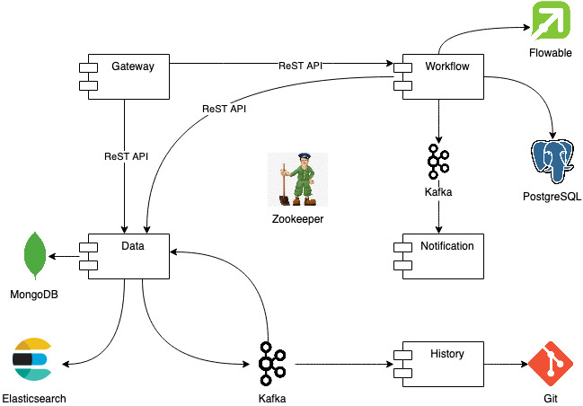

# Introduction

mscore is a headless microservice-based platform with user-defined data and process model. Basically mscore is a barebone system providing core (general) functionality to manipulate data using user-defined process.
It supports CRUD operation, searching capabilities, workflow execution, and notification via email.

It consists of:

1. Data service
2. Workflow service
3. Gateway
4. Notification service
5. History service

